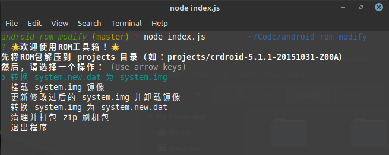

# android-rom-modify

> Android ROM 工具箱，仅限在 Linux 下使用。



## 功能特性 · Feature

- 转换 system.new.dat 为 system.img 
- 挂载 system.img 镜像 
- 更新修改过后的 system.img 并卸载镜像 
- 转换 system.img 为 system.new.dat 
- 清理并打包 zip 刷机包

## 如何使用 · How to use

```sh
npm install
node index.js
```
